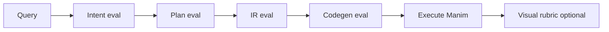

# Agentic workflows, intermediate representation, and external knowledge

This document collects **engineering guidance** for evolving Manimator-style systems: how to evaluate agent pipelines, how to harden the **intermediate representation (IR)** between intent and Manim code, and how to bring **external knowledge** in without degrading reliability. It is meant to complement `amoeba/docs/GUIDE.md` and the day-to-day code in `manimator/contracts/` and `manimator/agents/`.

---

## 1. Building evals for agentic workflows

Agentic systems fail in **multiple independent layers** (intent → plan → scene spec → code → render → critique). A single end-to-end score hides *where* regression happened. Treat evals as **layered contracts**, not one lucky demo.

### 1.1 Define stages and pass criteria

| Stage | What to measure | Typical signals |
|--------|------------------|-----------------|
| Intent | Scope, taxonomy, complexity | JSON schema pass rate, `in_scope` vs gold label |
| Decomposition | Scene count, ordering, prerequisites | Structural checks, human spot-check |
| Scene spec (IR) | Valid `SceneSpec` / plan objects | Pydantic validation, referential integrity (animation targets exist) |
| Codegen | Syntax, imports, `construct`, `play` | AST checks (you already do some of this), static rules |
| Execution | Manim runs, exit code | Timeout, stderr patterns |
| Visual / semantic | Does it teach the right thing? | Human rubric, optional vision model (high variance) |

**Suggestion:** Maintain a **small gold set** per stage (10–50 cases each) before scaling to hundreds. Failing fast on stage 2 is cheaper than rendering video for a doomed spec.

### 1.2 Offline vs online eval

- **Offline:** Fixed queries + frozen prompt versions + recorded LLM outputs (or mocks). Enables regression CI when keys are absent (`MANIMATOR_DRY_RUN`, recorded fixtures).
- **Online:** Live models, real latency and cost. Use for **periodic** runs and prompt A/B, not every PR.

**Advice:** Version everything that affects behavior: prompts (`INTENT_CLASSIFIER_PROMPT_VERSION`), model ids, and optionally a **dataset hash**. Your trace logs (`prompt_version`, `trace_id`, `MANIMATOR_METRICS_JSONL`) are the right direction—extend them with **`eval_set_id`** and **`case_id`** when running suites.

### 1.3 Metrics that actually help

- **Structured output rate:** % of LLM turns that parse and validate (JSON + Pydantic). Track by prompt version.
- **Repair rate:** How often codegen → validate → repair succeeds; average repair depth.
- **Cost / latency:** Per stage, from `LLMResponse` fields; alert on drift when prompt or model changes.
- **Task success:** Binary or rubric-scored, but only *after* lower layers pass—otherwise you are measuring “can Manim run” not “did we teach.”

### 1.4 LLM-as-judge: use with discipline

Judges are useful for **ranking** or **soft signals**, not as a single source of truth.

- Keep a **frozen judge prompt** and model when comparing candidate prompts.
- Prefer **rubric items** (clarity, correctness of concept, visual hierarchy) over one global score.
- Calibrate against **human labels** on a slice of data; if judge and human disagree often, fix the rubric before scaling.

### 1.5 Practical loop (recommended)

1. Add **contract tests** (already started for intent + dry run).
2. Add **IR fixture tests**: valid/invalid `SceneSpec` JSON files + expected validation errors.
3. Add **golden codegen snippets** for a few specs (snapshot or normalized AST comparison).
4. Run **nightly** online eval on a fixed suite; attach `trace_id` and prompt versions to results.
5. When a prompt changes, **re-run the same suite** and diff metrics before merging.

---

## 2. Maturing the intermediate representation—and where Manim and RL fit

In this codebase, the **IR** is the structured bridge between **natural language intent** and **executable Manim**: e.g. scene plans, `SceneSpec`-like objects (objects, animations, imports, voiceover hints), then Python. Making the IR “mature” means: **unambiguous semantics**, **strong validation**, **stable evolution**, and **testability** without always hitting the renderer.

### 2.1 Principles for a strong IR

1. **Separation of concerns**  
   - *Pedagogical* fields (beats, composition roles, purposes) vs *executable* fields (Manim types, params).  
   - Avoid overloading one JSON blob for both unless the schema is carefully layered.

2. **Referential integrity**  
   Every animation target must resolve to a defined object; imports must cover all referenced types; budgets and limits enforced **in the IR**, not only in prompts.

3. **Version the IR schema**  
   Like prompts: `scene_spec_version: "2026.04"` in payload or sidecar. Migrators for old fixtures keep eval history comparable.

4. **Deterministic lowering**  
   Codegen should be a **pure function** `IR → source` where possible; non-determinism belongs in LLM stages *before* IR freeze.

5. **Fuzzing and property tests**  
   Random valid IR instances (within constraints) should almost always produce parseable code; invalid IR should **always** fail validation with actionable errors.

### 2.2 Manim as execution target—not as the IR

Manim’s API is wide and procedural. The IR should stay **narrower** than full Manim: a **vocabulary** of approved animations, camera ops, and object constructors. That:

- Reduces codegen search space and failures.  
- Makes evals and static checks meaningful.  
- Lets you swap Manim versions behind a stable IR.

**Suggestion:** Maintain an **allowlist** of `type` strings for objects and animations, with parameter schemas (even if initially loose). Reject unknown types at validation time instead of at render time.

### 2.3 When “RL-based something” is worth it

Reinforcement learning is **not** a default win for codegen from LLMs. It shines when:

- You have a **simulator** or cheap proxy reward (e.g. layout metrics, collision-free placement, readability heuristics).  
- The action space is **discrete or low-dimensional** (which scene template, which camera move, timing knobs).  
- You can collect **many rollouts** without burning full video renders every step.

**Plausible RL-adjacent uses in your domain:**

- **Layout / timing policy:** Given a fixed IR “storyboard,” a small policy adjusts positions, `run_time`, or camera paths to maximize a **differentiable or cheap visual metric** (e.g. overlap penalty, text size bounds). Reward = heuristic score; occasional full render for calibration.  
- **Search over discrete plans:** Treat “which of K scene templates” or “which decomposition” as a bandit or contextual bandit problem using logged outcomes (success rate, user thumbs). This is often **simpler than full RL** and good enough.

**When to skip RL for now:**

- End-to-end “generate code → render → single scalar reward” with sparse success: sample-inefficient and expensive.  
- No clear simulator: you will overfit to renderer quirks.

**Advice:** Invest first in **IR + validation + evals**. Add **constrained optimization** (linear layout, timing rules) before deep RL. If you later add RL, bind it to **IR-level actions**, not raw Python tokens.

### 2.4 Making Manim-side feedback useful

- **Programmatic checks:** bounding boxes, max object count, minimum `Wait` after beats (your prompts already encode pedagogy—encode critical rules in validators too).  
- **Keyframe / thumbnail critic:** Cheaper than full video; still noisy—use as a **gate** with human override.  
- **Symbolic execution:** Rare for Manim; prefer **static analysis** on generated code plus IR consistency.

---

## 3. Inducing external knowledge in the best way

“External knowledge” here means anything not in the model weights: docs, textbooks, APIs, Wolfram, Wikipedia, course PDFs, etc. The goal is **grounded, controllable** use—not a firehose of context.

### 3.1 Pick a pattern by task type

| Pattern | Best when | Risk |
|---------|-----------|------|
| **Tool use (search, calculator, API)** | Facts change, need provenance | Latency, tool misuse |
| **RAG (chunk retrieval)** | Large static corpora, repeated domain | Stale chunks, wrong retrieval |
| **Curated knowledge packs** | Stable curriculum (definitions, standard diagrams) | Maintenance |
| **Long context (full doc)** | Single short doc, rare updates | Cost, distraction |

**Suggestion:** For **math/CS education**, combine **small curated packs** (definitions, notation) with **on-demand retrieval** for user-specific topics. Avoid dumping whole textbooks into every call.

### 3.2 Grounding discipline

1. **Retrieve → then generate:** Force the model to cite **chunk ids** or quoted spans in an intermediate step before planning animation.  
2. **Separate “facts” from “instructions”:** System prompt = behavior; retrieved text = **data** the model must not contradict.  
3. **Validate claims that matter:** For numerical or formal content, route through **symbolic or numeric tools** when possible; keep the IR free of unverified numbers.  
4. **Time-stamp and source** in logs: which corpus version, which retrieval query—same spirit as `prompt_version`.

### 3.3 Where to inject in the pipeline

- **Intent / scope:** Light retrieval to decide in-scope vs out-of-scope (dangerous if over-trusted—prefer conservative scope rules).  
- **Planning / IR:** **Highest leverage**—retrieve relevant definitions, standard visual metaphors, or prerequisite concepts **once**, then freeze into IR fields (e.g. `anchor_visual`, `question_answered`).  
- **Codegen:** Prefer **IR + allowlisted APIs** over pasting retrieved code verbatim.

### 3.4 Quality over quantity

- **Chunk size and overlap:** Tune for animation planning (concept-sized chunks, not random 512-token splits).  
- **HyDE / query expansion:** Can help retrieval; add eval hooks to see if recall@k improves **downstream IR quality**, not just embedding similarity.  
- **Negative knowledge:** Explicitly encode “do not use” patterns (e.g. biology examples) in prompts **and** validators where possible.

### 3.5 Safety and licensing

- Log **sources** for external text used in production.  
- Respect licenses for training/eval corpora; keep **user-provided uploads** isolated from default retrieval indices if needed.

---

## Summary priorities (opinionated order)

1. **Layered evals** tied to prompt and IR versions, with cheap CI and richer nightly runs.  
2. **IR schema versioning, validation, and allowlists**—Manim stays behind a narrow interface.  
3. **Structured external knowledge** (curated + retrieval + tools) injected **before** IR freeze, with provenance in traces.  
4. **RL or bandits** only after metrics exist—target **layout/plan choices** with cheap rewards, not end-to-end code RL.

---

## Related repo artifacts

- Contracts / IR shapes: `manimator/contracts/` (`scene_spec.py`, `scene_plan.py`, `intent.py`, `validation.py`).  
- Observability and traces: `amoeba/observability/`, `amoeba/docs/GUIDE.md`, intent metrics in `manimator/agents/intent_classifier.py`.  
- Prompt versioning: `manimator/prompts/`.  
- Session log (example of incremental progress): `docs/2026-04-03-session.md`.

---

*This is a living strategy note. Update it when you change IR major versions, eval policy, or knowledge architecture.*
