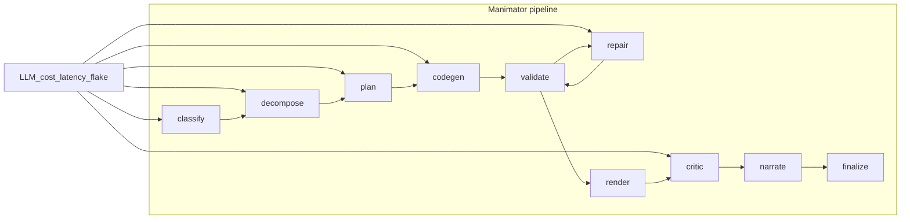

# How to take this project forward (engineering reality check)

This document is an unsentimental read on the **OpenClassrooms** monorepo: what works, what hurts, what will fail under pressure, and what to do next. It is written for someone who has to ship or maintain the system, not for a pitch deck.

---

## What this repo actually is

This is a **uv-managed Python workspace** with four members—`manimator` (agentic animation pipeline), `autolecture`, `webapp`, and `amoeba`—plus a root **metapackage** named `openclassrooms` that does not ship application code by itself. See [README.md](../README.md) and [pyproject.toml](../pyproject.toml).

Treat it as **research adjacent to product**: the most elaborate path is Manimator (LangGraph, LLMs, Manim, narration). The other packages share the workspace but do not magically share the same maturity bar. If you “take the project forward” without naming which surface (CLI pipeline, webapp, library consumers), you will optimize the wrong thing.

---

## What is legitimately good

- **Single toolchain (uv)** — Workspace sync, lockfile workflow, and package-scoped dependencies are documented and consistent with how serious Python shops want to work ([DEVELOPMENT.md](../DEVELOPMENT.md), [AGENTS.md](../AGENTS.md)).
- **Pipeline shape** — A compiled LangGraph with explicit nodes and conditional edges is easier to reason about than an ad-hoc script soup. The graph is centralized in [`manimator/pipeline/graph.py`](../manimator/pipeline/graph.py).
- **Contracts between stages** — Pydantic models under `manimator/contracts/` bound what each stage may emit; that is the right direction for reducing silent JSON drift.
- **Per-run artifacts and IR** — Grouping outputs under `outputs/runs/<run_id>/` and persisting an IR bundle gives you a forensic trail and a path toward evals, replay, and downstream tooling (see [docs/2026-04-03-session.md](2026-04-03-session.md)).
- **Operational intent** — Structured logging, trace/run alignment with Amoeba, typed exceptions, and prompt registries are the bones of a system you can debug at 2 a.m.
- **Documentation that admits footguns** — The README explicitly warns about `import logging` shadowing; that honesty saves hours. Most repos bury that in closed issues.

---

## What is broken, awkward, or expensive

### Python 3.14 as a baseline

The workspace pins `requires-python = ">=3.14"` (root and e.g. [`manimator/pyproject.toml`](../manimator/pyproject.toml)). That is a **deliberate bet on the bleeding edge**.

**Why it bites:** fewer prebuilt wheels, more compile-from-source, more “CI green locally red” stories, and a smaller pool of contributors who already run 3.14. You are paying coordination tax for features you may not need yet. If you want adoption, this is the first thing outsiders will bounce off.

### Stdlib collision: `manimator.logging`

The package ships a **`logging` submodule** under the `manimator` tree. If the project root ordering on `sys.path` is wrong, **`import logging` resolves to the wrong module** and the process dies in confusing ways. The README tells you to prefer `python -m manimator.main` for a reason ([README.md](../README.md)).

**Brutal framing:** naming a first-party module in a way that can shadow the standard library is **unforced error**. Every new script, notebook, and test file is a lottery ticket. The “fix” is not more README text forever; it is a **rename or structural isolation** so the hazard cannot occur.

### Nonstandard Manimator packaging

[`manimator/pyproject.toml`](../manimator/pyproject.toml) maps the installable `manimator` package to `"."` inside the `manimator/` directory and enumerates packages explicitly—including **`manimator.tests`** in the installed package set.

**Why it bites:** IDEs, pytest collection, and “where do I run this from?” all become context-dependent. New contributors will run commands from the wrong directory and get import errors that look like “Python is broken” instead of “layout is exotic.”

### Testing split brain

- The [Makefile](../Makefile) exercises several agents by shelling out to `uv run python manimator/agents/...` and scraping **log files** under `logs/`. That is closer to a smoke harness than a regression suite.
- Pytest under `manimator/tests/` is the right direction, but [`manimator/tests/test_pipeline.py`](../manimator/tests/test_pipeline.py) imports:

  ```python
  from pipeline.graph import pipeline
  from pipeline.state import PipelineState
  ```

  while [`manimator/main.py`](../manimator/main.py) uses `from manimator.pipeline.graph import pipeline`. Those paths rely on different `sys.path` layouts. **One layout change breaks the tests while production still runs (or vice versa).** That is debt with interest.

### LLM reality without a full offline story

`MANIMATOR_DRY_RUN` short-circuits **intent classification only** ([`manimator/agents/intent_classifier.py`](../manimator/agents/intent_classifier.py)). Downstream nodes still expect real model behavior unless you have broader stubs or recorded fixtures.

**Consequence:** “full pipeline” tests are **slow, costly, nondeterministic, and environment-dependent** unless you invest in offline data. The repo’s own eval direction is acknowledged in [AGENTIC_IR_AND_KNOWLEDGE.md](AGENTIC_IR_AND_KNOWLEDGE.md); the gap is **execution**, not ideas.

### Honest product gap in tests

`test_pipeline_rejects_out_of_scope` in [`test_pipeline.py`](../manimator/tests/test_pipeline.py) states that the stub classifier **always returns `in_scope=True`** and that the test will become meaningful later. Today, **you are not testing the policy you think you are selling** (rejecting bad queries). Do not confuse “pipeline returns a dict” with “pipeline enforces scope.”

### CI absent from this tree

There is **no** `.github/workflows/*.yml` in the repository—only [`.github/copilot-instructions.md`](../.github/copilot-instructions.md). If you do not have CI elsewhere (private runner, another repo), then **merge quality is tribal knowledge**. That does not scale past a handful of people.

### Supply chain and optional deps

Optional TTS pulls **KittenTTS** via a **direct wheel URL** in [`manimator/pyproject.toml`](../manimator/pyproject.toml). That is reproducible until the URL moves or the artifact is compromised. Treat it as a **pin with a governance story**, not “set and forget.”

### Stubs at the edge

Render and critic paths are not fully “vision in, judgment out” production semantics; parts of the stack still behave like placeholders (e.g. critic stub behavior noted in agent code). **Demos will outrun reliability** unless you label what is real.

---

## Bottlenecks (where time and money go)



- **Sequential LLM chain** — Each hop adds latency and failure modes; repair loops multiply calls.
- **Manim renders** — CPU/GPU and filesystem I/O dominate wall clock once codegen succeeds.
- **Debugging** — Failures are spread across nodes; without golden fixtures you are often re-running the whole graph to learn one fact.
- **Disk** — Per-run trees under `outputs/` grow quickly; you need retention policy or you will drown in artifacts.

---

## What will bite you next (ranked)

1. **Onboarding** — 3.14 + exotic package layout + path rules = first-week frustration.
2. **No in-repo CI** — Regressions slip until someone runs the right target locally.
3. **Flaky or skipped integration tests** — Some tests skip without `GROQ_API_KEY` ([`manimator/tests/agents/test_intent_classifier.py`](../manimator/tests/agents/test_intent_classifier.py)); pipeline tests do not carry the same obvious gate in-file—**know what your default `pytest` run actually proves**.
4. **Prompt and model drift** — Without pinned evals and recorded outputs, “it got worse” is a feeling, not a diff.
5. **Secrets** — `.env` sprawl and API keys in developer machines do not migrate to production by copy-paste; plan for secret management before you scale users.
6. **Surface area creep** — `webapp` and `autolecture` dilute focus unless you staff them as first-class products.

---

## Recommended forward path (roughly 90 days, concrete)

These are ordered for **risk reduction per unit of effort**, not for glamour.

1. **Rename or relocate `manimator.logging`** (or otherwise make stdlib `logging` unshadowable from any supported entrypoint). Treat README warnings as a stopgap with an expiry date.
2. **Normalize imports** — Tests and tools should import `manimator.pipeline.*` consistently, same as production entrypoints.
3. **Add minimal CI in this repo** — At least: `uv sync --all-packages --frozen`, fast contract/unit tests, and a **documented** pipeline smoke mode that does not require paid API calls (expand dry-run/stubs or commit small recorded LLM JSON fixtures). See [AGENTIC_IR_AND_KNOWLEDGE.md](AGENTIC_IR_AND_KNOWLEDGE.md) for the eval philosophy.
4. **Make Makefile smoke vs pytest regression explicit** — Either fold agent smokes into pytest or document that Makefile targets are **manual** and not merge gates.
5. **Implement real out-of-scope behavior** — Until then, remove marketing claims that imply strict gating; keep the test as a **skipped xfail** or assert the actual contract.
6. **Define SLOs** — e.g. p95 run time, $ per successful video, acceptable validation retry rate. Without numbers, you cannot prioritize render vs model vs repair.
7. **Revisit Python version policy** — If 3.14 is not load-bearing, consider supporting 3.12/3.13 for the library packages to widen the contributor and deployment base.

Architecture freeze and vocabulary for agents vs nodes vs contracts already exist in [`manimator/AGENTIC_ARCHITECTURE_GUIDE.md`](../manimator/AGENTIC_ARCHITECTURE_GUIDE.md); use that doc so you do not re-litigate structure every sprint.

---

## Anti-patterns to avoid

- **Adding agents before eval harness** — More stages multiply cost and failure; lock measurement first.
- **Running from random working directories** without `python -m` where required—you will rediscover `logging` shadowing forever.
- **Treating README caveats as optional** — They document real incidents waiting to repeat.
- **Confusing IR snapshots with a product** — Bundles are infrastructure for trust and tooling; users still need reliability and UX.

---

## Closing

The codebase shows **real systems thinking** (contracts, graph, observability, IR). The gaps are **classic scale problems**: CI, determinism, packaging hygiene, and honest scope tests. Fix those and the ambitious parts of the stack stop fighting the basics. Skip them and you will ship impressive demos that fall over when another human touches the repo.
