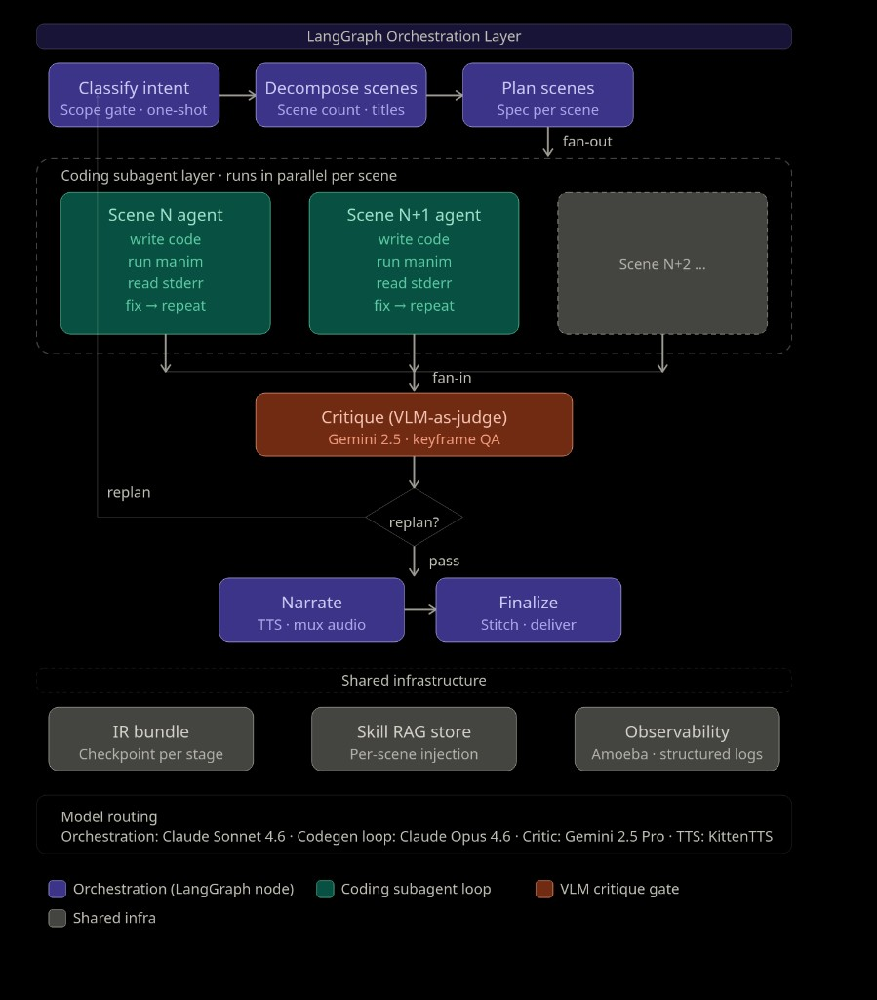
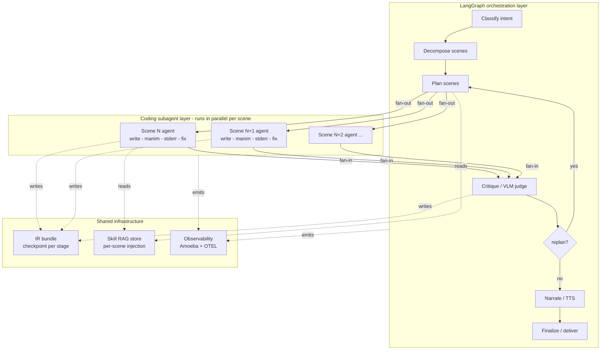

# Migration to a Subagent Pipeline

Status: proposed
Owner: @nabin2004
Last updated: 2026-04-19

This document explains **why** the Manimator pipeline should migrate from its current node-per-stage LangGraph DAG to a **parallel subagent + VLM-judge** architecture, **how** to execute that migration in five small, shippable phases, and **which frameworks and dev tools** to keep, add, or replace along the way.

It is opinionated. It is anchored to specific files in this repo. It stays inside the current uv workspace conventions described in [AGENTS.md](../AGENTS.md) and [DEVELOPMENT.md](../DEVELOPMENT.md).

---

## 1. TL;DR

Five decisions, one table.

| # | Decision | Touches | Expected win |
|---|----------|---------|--------------|
| D1 | Collapse `codegen → validate → repair → render` into one subagent node with an Anthropic tool-use inner loop. | [`manimator/pipeline/graph.py`](../manimator/pipeline/graph.py), [`manimator/agents/codegen.py`](../manimator/agents/codegen.py), [`manimator/agents/validator.py`](../manimator/agents/validator.py), [`manimator/agents/repair.py`](../manimator/agents/repair.py), [`manimator/pipeline/state.py`](../manimator/pipeline/state.py) | Feedback loop driven by real `manim` stderr, not by graph edges. Fewer nodes, fewer conditional edges, learning codegen. |
| D2 | Fan out per-scene subagents with `asyncio.gather`. | [`manimator/pipeline/graph.py`](../manimator/pipeline/graph.py) | 3–5x wall-clock speedup on multi-scene runs. |
| D3 | Selective Manim skill injection per scene (RAG over a small snippet store). | [`manimator/agents/planner.py`](../manimator/agents/planner.py), [`manimator/contracts/scene_spec.py`](../manimator/contracts/scene_spec.py), [`manimator/prompts/registry.py`](../manimator/prompts/registry.py), new `manimator/skills/` | Smaller prompts, higher first-try render rate, cheaper tokens. |
| D4 | Replace the stub critic with a Gemini 2.5 Pro VLM-as-judge that scores **aesthetic** and **pedagogical** axes separately. | [`manimator/agents/critic.py`](../manimator/agents/critic.py), `edge_after_critique` in [`manimator/pipeline/graph.py`](../manimator/pipeline/graph.py) | Pedagogical failures replan; aesthetic failures stay inside the subagent loop. Fewer wasted replans. |
| D5 | Route models by node instead of one-model-everywhere. | new `manimator/runtime/routing.py`, `model_routing.yaml` | Opus spend only where quality is made (codegen); Sonnet/Gemini elsewhere. |

**Non-goals.** We are **not** touching: the Pydantic contracts under [`manimator/contracts/`](../manimator/contracts/), the per-run IR bundle in [`manimator/ir.py`](../manimator/ir.py), Amoeba trace/run IDs, KittenTTS narration ([`manimator/audio/`](../manimator/audio/)), the delivery package builder ([`manimator/video/delivery.py`](../manimator/video/delivery.py)), the `plan → critique → replan` loop **at the graph level**, the uv workspace layout, or Python 3.14 as a baseline.

---

## 2. Why migrate

All five motivations come directly from reading the code in this repo today.

### 2.1 A hidden serial bottleneck in every multi-scene run

Every per-scene operation in [`manimator/pipeline/graph.py`](../manimator/pipeline/graph.py) is a synchronous `for spec in state.scene_specs` loop. `node_plan_scenes`, `node_generate_code`, `node_validate`, and `node_render` all look like this:

```94:122:manimator/pipeline/graph.py
async def node_generate_code(state: PipelineState) -> dict:
    ...
    for spec in state.scene_specs:
        ...
        code = await generate_code(spec)
        codes[spec.scene_id] = code
```

A 5-scene video therefore takes roughly 5x a 1-scene video even though scenes are independent. This is the single cheapest win on the board.

### 2.2 Codegen cannot learn

`generate_code` in [`manimator/agents/codegen.py`](../manimator/agents/codegen.py) is a **pure string-template**. It stitches `SceneSpec` fields into a Manim script; there is no LLM, no tool-use, no self-correction:

```10:31:manimator/agents/codegen.py
async def generate_code(spec: SceneSpec) -> str:
    animation_imports = set()
    for anim in spec.animations:
        animation_imports.add(anim.type)
    ...
    for anim in spec.animations:
        params = format_params(anim.params)
        animation_lines.append(
            f"self.play({anim.type}({anim.target}{params}), run_time={anim.run_time})"
        )
```

The only way it "repairs" is by bouncing through `node_validate → node_repair → node_validate` edges in the graph, with a `retry_counts` dict in `PipelineState`. The research patterns we want to match — TheoremExplainAgent's N=5 inner retries inside the coding agent, `manim-generator`'s Code Writer ↔ Code Reviewer loop — all place this feedback **inside the node**, driven by real `manim` stderr, not by LangGraph edges.

### 2.3 The feedback loop lives at the wrong layer

`edge_after_validate` is exactly the kind of logic that should not be a graph edge:

```370:379:manimator/pipeline/graph.py
def edge_after_validate(state: PipelineState) -> str:
    if not state.failed_scene_ids:
        return "render"
    for scene_id in state.failed_scene_ids:
        retry = state.retry_counts.get(scene_id, 0)
        if retry >= MAX_RETRIES:
            return "render"
    return "repair"
```

This is pipeline state being used to simulate what an in-node `while stop_reason != "end_turn"` loop does natively. It leaks execution-level concerns (retries) into the orchestration layer and forces `retry_counts` into [`manimator/pipeline/state.py`](../manimator/pipeline/state.py), where they do not belong.

### 2.4 The critic is a stub, not a judge

[`manimator/agents/critic.py`](../manimator/agents/critic.py) has a good system prompt but a **stub body** that returns fixed scores:

```47:67:manimator/agents/critic.py
    # STUB IMPLEMENTATION: Since render is a stub, we'll do a basic critique
    # without actual image analysis
    log.debug("Using stub critic implementation (no actual image analysis)")

    r_visual = 0.7
    r_semantic = 0.8
    combined = round(0.5 * r_visual + 0.5 * r_semantic, 6)

    replan_required = combined < DEFAULT_THRESHOLD
```

Two problems: (a) no real multimodal evaluation, and (b) a single `combined_score` conflates aesthetic and pedagogical failure modes, so when it does fail it can only trigger a full `replan → plan` cycle. Aesthetic failures (bad layout, unreadable color) should re-enter the **scene subagent loop**, not cause a full replan.

### 2.5 Every codegen call carries the whole Manim API

The registry in [`manimator/prompts/`](../manimator/prompts/) does not scope which Manim classes each scene needs. Every codegen call pays the token tax for `ThreeDScene` even when the scene is a 2D graph. The fix is selective skill injection driven by the planner — an idea the Manimator / OpenClaw research already validates.

---

## 3. Target architecture

The target is already captured in the diagram below. LangGraph keeps orchestrating the pipeline-level decisions (intent gate, plan, critique gate, narrate → finalize). The codegen subagent loop becomes a single node that fans out to one tool-using subagent per scene.



A mermaid mirror of the same diagram, so this doc renders in plain markdown viewers:



---

## 4. The five decisions, elaborated

Each decision is: current pointer → target sketch → migration note.

### D1. Collapse codegen + validate + repair + render into one subagent node

**Current.** Four separate nodes wired by conditional edges:

```419:428:manimator/pipeline/graph.py
    graph.add_edge("plan", "codegen")
    graph.add_edge("codegen", "validate")
    graph.add_conditional_edges("validate", edge_after_validate, {
        "render": "render",
        "repair": "repair",
    })
    graph.add_edge("repair", "validate")
    graph.add_edge("render", "critique")
```

**Target.** One node, `node_codegen_render_agent`. Inside it, one subagent per scene, each running an Anthropic tool-use loop with a small tool set:

```python
# pseudocode - target
TOOLS = [
    write_scene_py,   # write code to outputs/runs/<run_id>/code/scene_<id>.py
    run_manim,        # subprocess call, returns stdout+stderr+returncode
    read_stderr,      # fetch last render's stderr
    patch_scene_py,   # apply a unified-diff patch
]

async def run_scene_agent(spec: SceneSpec, paths: RunPaths) -> SceneResult:
    client = anthropic.AsyncAnthropic()
    messages = [build_initial_codegen_prompt(spec, skills=retrieve_skills(spec))]
    for _ in range(MAX_INNER_TURNS):  # e.g. 5
        resp = await client.messages.create(
            model=route("codegen_render_agent"),
            tools=TOOLS, messages=messages, ...,
        )
        if resp.stop_reason == "end_turn":
            return SceneResult.ok(scene_id=spec.scene_id, video_path=...)
        messages.extend(execute_tool_calls(resp, paths))
    return SceneResult.failed(scene_id=spec.scene_id, reason="max_turns")
```

**Migration note.** The existing logic is not thrown away — it becomes the body of the `run_manim` / validator tool. The subprocess pattern in `node_render` in [`manimator/pipeline/graph.py`](../manimator/pipeline/graph.py) (`run_subprocess`, output-file discovery via `paths.manim_media_dir`) moves wholesale into the `run_manim` tool. The AST/stderr-parsing work in [`manimator/agents/validator.py`](../manimator/agents/validator.py) becomes a pre-check that the subagent can call before shelling out to `manim`.

After D1, `retry_counts` in [`manimator/pipeline/state.py`](../manimator/pipeline/state.py) is deleted — retries are an agent-local counter, not graph state.

### D2. Parallel scene subagents with `asyncio.gather`

**Current.** Serial `for` loop (see 2.1).

**Target.**

```python
async def node_codegen_render_agent(state: PipelineState) -> dict:
    sem = asyncio.Semaphore(int(os.getenv("MAX_PARALLEL_SCENES", "3")))
    async def guarded(spec):
        async with sem:
            return await run_scene_agent(spec, get_run_paths(state.run_id))
    results = await asyncio.gather(
        *[guarded(spec) for spec in state.scene_specs],
        return_exceptions=True,
    )
    return collapse_into_state(results)
```

**Migration note.** The `asyncio.Semaphore` is not optional — raw `asyncio.gather` on 10 scenes can swamp both the API provider's RPS and the local `manim` CPU pool. Default 3, overridable via env var. This single change gives a 3–5x wall-clock speedup even before D1.

### D3. Selective Manim skill injection

**Current.** `plan_scene` in [`manimator/agents/planner.py`](../manimator/agents/planner.py) emits a `SceneSpec`, but no machine-readable list of required Manim primitives. Codegen prompts (when they exist under [`manimator/prompts/scene_planner/`](../manimator/prompts/scene_planner/)) dump the whole surface.

**Target.**

1. Add `required_skills: list[str]` to [`manimator/contracts/scene_spec.py`](../manimator/contracts/scene_spec.py) (bump `schema_version`).
2. Update the `plan_scene` prompt to emit a closed-vocabulary list from a fixed enum: `["three_d_scene", "graph", "math_tex", "value_tracker", "transform", "group_mobject", ...]`.
3. Create `manimator/skills/` with one `.md` file per skill (100–300 token snippet with canonical import + minimal working example).
4. At subagent boot, retrieve the matching snippets and concatenate them into the system prompt. Keep the index in LanceDB for similarity fallback, but exact-match by name is the primary path.

**Migration note.** Do not over-engineer this. We have on the order of 30–50 useful Manim primitives. A dict lookup by name is a perfectly good v1; the vector index only matters when the planner emits something the enum does not cover.

### D4. VLM-as-judge critic with two axes

**Current.** Stub returning fixed scores (see 2.4). The prompt file also uses `gpt-4o-mini` by default.

**Target.**

```python
# pseudocode - target
class CriticResult(BaseModel):
    schema_version: int = 2
    aesthetic_score: float      # layout, color, readability
    pedagogical_score: float    # does the animation actually explain it
    per_scene: dict[int, SceneCritique]
    replan_required: bool       # true iff pedagogical_score < P_THRESHOLD
    aesthetic_feedback_by_scene: dict[int, str]
```

Swap the critic to call Gemini 2.5 Pro via `google-genai` with:

- Deterministic keyframe sampling (e.g. 3 frames at fixed percentiles of each MP4's duration via ffmpeg).
- `temperature=0`, JSON-schema-constrained response.
- On parse failure, fall back to the current stub so the pipeline never dead-ends.

Split `edge_after_critique` so pedagogical failures go to `replan` (unchanged), but aesthetic failures re-enter the **subagent loop** with the feedback injected as a new user turn — no full replan.

### D5. Model routing by node

**Current.** Each agent module picks its own model via environment variables (`CRITIC_MODEL`, etc.), scattered and inconsistent.

**Target.** One `model_routing.yaml` and one helper:

```yaml
# manimator/runtime/model_routing.yaml
nodes:
  classify:              {provider: anthropic, model: claude-sonnet-4.6}
  decompose:             {provider: anthropic, model: claude-sonnet-4.6}
  plan:                  {provider: anthropic, model: claude-sonnet-4.6}
  codegen_render_agent:  {provider: anthropic, model: claude-opus-4.6}
  critique:              {provider: google,    model: gemini-2.5-pro}
  narrate:               {provider: kittentts, model: default}
```

```python
# manimator/runtime/routing.py
def route(node: str) -> ModelConfig: ...
```

Wire `route(node)` through the existing provider shim in [`manimator/agents/json_llm.py`](../manimator/agents/json_llm.py) and [`manimator/agents/llm_response.py`](../manimator/agents/llm_response.py). Environment overrides stay supported for experiments (`MANIMATOR_CODEGEN_MODEL=claude-sonnet-4.6`).

---

## 5. Migration plan — five small phases

Each phase is independently shippable, keeps `make test-pipeline` green, and can be merged behind a feature flag.

### Phase 0 — Scaffolding (0.5 day)

- Add `docs/assets/target-architecture.png` (done).
- Add `manimator/runtime/routing.py` + `model_routing.yaml`. No graph changes yet.
- Add a `MANIMATOR_SUBAGENT` env var in [`manimator/runtime_env.py`](../manimator/runtime_env.py) (default `0`). Gates all of the following.

### Phase 1 — Parallel fan-out only (1 day)

- Keep template codegen intact.
- Replace the `for spec` loops in `node_plan_scenes`, `node_generate_code`, `node_validate`, and `node_render` in [`manimator/pipeline/graph.py`](../manimator/pipeline/graph.py) with `asyncio.gather` under a `Semaphore(MAX_PARALLEL_SCENES)`.
- Add a new pytest: `manimator/tests/pipeline/test_parallel_fanout.py` that asserts 5-scene wall-clock < 1.3 × 1-scene wall-clock on a synthetic fast-render fixture.

### Phase 2 — Subagent loop (3–5 days)

- Implement `run_scene_agent` (D1). Keep it gated behind `MANIMATOR_SUBAGENT=1`.
- Add tools: `write_scene_py`, `run_manim`, `read_stderr`, `patch_scene_py`.
- Route a subset of scenes through it in parallel with the legacy path to build parity confidence on the golden set from [`manimator/tests/`](../manimator/tests/).
- Once parity holds, collapse `codegen → validate → repair → render` into the single `node_codegen_render_agent` node and delete the three dead nodes and `edge_after_validate`.

### Phase 3 — Skill RAG (2 days)

- Create `manimator/skills/*.md` (start with 15 snippets covering the most-used primitives).
- Extend `SceneSpec` with `required_skills`; bump `schema_version`.
- Update the planner prompt to emit the list; update the subagent system-prompt builder to pull the matching snippets.
- Optional: index the snippets in LanceDB for similarity fallback.

### Phase 4 — VLM critic + routed models (2 days)

- Replace [`manimator/agents/critic.py`](../manimator/agents/critic.py) with the Gemini 2.5 Pro implementation (D4).
- Split `edge_after_critique` so aesthetic feedback re-enters the subagent loop and only pedagogical failures trigger `replan`.
- Flip `model_routing.yaml` so Opus runs only inside `codegen_render_agent`.

### Phase 5 — Cleanup (1 day)

- Delete the now-unused `node_validate`, `node_repair`, `node_render` from [`manimator/pipeline/graph.py`](../manimator/pipeline/graph.py).
- Delete `retry_counts` from [`manimator/pipeline/state.py`](../manimator/pipeline/state.py).
- Update [`docs/PROJECT_FORWARD.md`](PROJECT_FORWARD.md) and [`STRATEGIC_ROADMAP.md`](../STRATEGIC_ROADMAP.md) to reflect the new graph shape.
- Remove the `MANIMATOR_SUBAGENT` flag once the migration is fully rolled out.

Total: **9.5–11.5 engineering days**, each phase landing independently.

---

## 6. Full tooling audit

The user asked for a full audit — so each area gets a keep/replace recommendation with rationale.

### 6.1 Orchestration — keep LangGraph, narrow its job

LangGraph is the right layer for pipeline-level control flow (intent gate, replan loop, narrate → finalize). After D1, LangGraph's total node count drops from 10 to 6 (`classify`, `decompose`, `plan`, `codegen_render_agent`, `critique`, `narrate`, `finalize`), and the **only** conditional edges that remain are `edge_after_intent` and `edge_after_critique`.

Alternatives considered and rejected **for now**:

- **PydanticAI.** Excellent for typed agent I/O, weaker for multi-node orchestration with replan cycles.
- **Burr.** Nice state-machine framing, but a smaller ecosystem and weaker async story than LangGraph.
- **Temporal.** Overkill without multi-host execution; adds ops burden.
- **Raw asyncio + custom state.** Loses the visual / replay benefits the replan graph already gives us.

Decision: LangGraph stays. The subagent loop inside D1 is what moves **out** of LangGraph (into Anthropic tool-use), not LangGraph itself.

### 6.2 Subagent loop — Anthropic SDK tool-use directly

Do **not** wrap the inner loop in LangChain agents, smolagents, or any agent framework. The inner loop is literally:

```python
while resp.stop_reason != "end_turn":
    resp = client.messages.create(..., tools=TOOLS)
    execute_tool_calls(resp)
```

The shim already exists in [`manimator/agents/json_llm.py`](../manimator/agents/json_llm.py) and [`manimator/agents/llm_response.py`](../manimator/agents/llm_response.py); extend it with a thin `tool_use_loop(messages, tools, model)` helper. Frameworks would add abstraction tax with no benefit.

### 6.3 Skill RAG — LanceDB (recommended) over FAISS or Chroma

- **LanceDB.** Apache-2, single-file embedded, no server, good metadata story. Perfect for a 200-snippet corpus.
- **FAISS + `sentence-transformers`.** Battle-tested but has no metadata store on its own, so you end up building a sidecar dict anyway.
- **Chroma / LlamaIndex.** Too heavy for this corpus size.

Add with `uv add --package manimator lancedb sentence-transformers` per [AGENTS.md](../AGENTS.md) conventions.

### 6.4 Validator — retire as a graph node, keep as a subagent tool

[`manimator/agents/validator.py`](../manimator/agents/validator.py) becomes a tool exposed to the subagent. Add a fast `py_compile` pre-check before the `manim` subprocess invocation — it catches 80% of syntax failures in milliseconds instead of seconds. The stderr-parsing logic already in `validator.py` is reused by the `read_stderr` tool to surface a structured `{error_type, error_line, error_message}` back to the subagent.

### 6.5 Critic — Gemini 2.5 Pro via `google-genai`

- **Gemini 2.5 Pro.** Current best multimodal reasoning, strong at both layout critique and pedagogical coherence.
- **GPT-4o.** Fine, but redundant with an already Anthropic-heavy stack — one less provider to manage is a real win.
- **Qwen2-VL / local open-weights.** Good path in ~3 months when we have fine-tuning infrastructure per [`docs/finetuning_playbook.md`](finetuning_playbook.md). Requires a GPU we do not need to block on today.

Keep frame extraction via `ffmpeg` through `amoeba.subprocess`.

### 6.6 Observability — keep Amoeba, add OpenTelemetry export

The structured log calls in [`manimator/pipeline/graph.py`](../manimator/pipeline/graph.py) (`log_structured(get_amoeba_logger(), ...)`) are good. Do **not** replace them. Add an OTEL exporter so traces can flow into **Langfuse** (recommended, OSS, LLM-native) or Arize for per-run LLM cost/latency dashboards. This is additive: Amoeba stays as the primary in-repo observability layer, OTEL is the egress.

### 6.7 Prompt registry — keep `manimator/prompts/registry.py`

The current registry is sufficient. **BAML** is attractive if typed prompt I/O becomes painful, but our Pydantic contracts + `json_llm` already give us most of what BAML offers. Defer.

### 6.8 Dataset / eval tooling — formalize what is already emerging

Stay aligned with [`docs/finetuning_playbook.md`](finetuning_playbook.md) and the batch docs under `manimator/batch/`:

- **Per-stage JSONL export.** Continue the convention introduced by `manimator/batch/export.py`. Every pipeline run emits one JSONL per stage keyed by `run_id` + `stage` + `schema_version`.
- **Add `manimator/eval/`.** One evaluator per stage:
  - `eval_decomposer.py` — scene coherence (LLM-as-judge).
  - `eval_planner.py` — % specs that pass validator on first try.
  - `eval_codegen.py` — % renders that succeed without repair.
  - `eval_critic.py` — correlation between VLM scores and human ratings on a held-out set.
- **Loading.** HuggingFace `datasets` for JSONL → `Dataset`.
- **Experiment tracking.** Weights & Biases free tier. Already in the roadmap.
- **Versioning.** DVC is overkill at current scale; the `batch-id` + `manifest.json` pattern in [`manimator/batch/`](../manimator/batch/) is sufficient for now.

### 6.9 Dev tools — keep uv, ruff, pytest; add pre-commit and type gating

Currently solid:

- **uv** (per [AGENTS.md](../AGENTS.md)) — keep, no question.
- **ruff** — keep; extend with `ruff format` as the canonical formatter.
- **pytest** — keep; consolidate the scattered top-level `test_*.py` files in the repo root into `manimator/tests/` subfolders (see [PROJECT_FORWARD.md](PROJECT_FORWARD.md) for the "testing split brain" critique).

Missing, add:

- **pre-commit** with `ruff check`, `ruff format`, and `pytest -q manimator/tests/agents/` on staged paths.
- **pyright** (or `mypy --strict` on `manimator/contracts/` only; contracts benefit the most from strict typing, the rest of the code can stay at basic mode).
- **justfile** — optional, thinner than the root [`Makefile`](../Makefile); not required.
- **GitHub Actions CI** job that runs `make test-all` on 3.14 and posts coverage + per-stage eval deltas on PR.

---

## 7. Risks, trade-offs, non-goals

### Risks and mitigations

| Risk | Mitigation |
|------|------------|
| Opus cost in the subagent loop explodes. | Cap inner turns at N=5 (TheoremExplainAgent default). First attempt on Sonnet, escalate to Opus only on retry. Emit per-run token cost to Amoeba; alert when > 2σ above run-type mean. |
| Parallel fan-out swamps the GPU / manim CPU pool. | `asyncio.Semaphore(MAX_PARALLEL_SCENES)`, default 3, env-overridable. |
| VLM judge returns flaky or malformed JSON. | Deterministic keyframe sampling, `temperature=0`, JSON-schema-constrained response, fall back to the stub critic on parse failure so the pipeline never dead-ends. |
| LanceDB or sentence-transformers add install weight. | Both are pure-Python + C extensions available as prebuilt wheels for 3.14; lock with `make lock` after adding. |
| Migrating the critic changes the `CriticResult` contract. | Bump `schema_version` on [`manimator/contracts/critic.py`](../manimator/contracts/critic.py); keep a shim that computes `combined_score` for downstream consumers until they are updated. |
| Feature flag rot — `MANIMATOR_SUBAGENT` never gets removed. | Add a GH Issue tied to Phase 5 explicitly blocking release on flag removal. |

### Explicit non-goals

- Not changing the Pydantic contracts under [`manimator/contracts/`](../manimator/contracts/) (only bumping `schema_version` where behavior changes).
- Not replacing KittenTTS.
- Not moving off LangGraph.
- Not rewriting the `webapp/`, `autolecture/`, or `amoeba/` packages.
- Not switching Python versions or uv.

---

## 8. Done criteria

The migration is complete when **all** of the following hold:

- [ ] All existing tests in `manimator/tests/` pass on 3.14 via `make test-all`.
- [ ] New test `manimator/tests/pipeline/test_parallel_fanout.py` asserts 5-scene wall-clock < 1.3 × 1-scene wall-clock on a fast-render fixture.
- [ ] `make test-pipeline` green with `MANIMATOR_SUBAGENT=1` (and remains green after the flag is removed in Phase 5).
- [ ] Per-run IR bundle under `outputs/runs/<run_id>/` still contains every artifact it contains today. Replay from IR bundle succeeds on a captured run.
- [ ] Codegen first-try render rate (measured by `manimator/eval/eval_codegen.py`) is ≥ 1.5× the pre-migration baseline on the golden query set.
- [ ] VLM critic scores correlate with human ratings at r ≥ 0.6 on a held-out set of 50 runs.
- [ ] Amoeba emits a per-node structured log line at start + completion for every pipeline run (unchanged from today, verified post-migration).
- [ ] [`README.md`](../README.md) and [`docs/PROJECT_FORWARD.md`](PROJECT_FORWARD.md) link to this document from their Architecture sections.
- [ ] `retry_counts` is removed from `PipelineState`; `MANIMATOR_SUBAGENT` flag is removed from `runtime_env.py`.

---

## Appendix A — Reading list (why this migration, in the literature)

- **TheoremExplainAgent** — coding agent generates Manim scripts with an N=5 retry budget inside the agent, not in the orchestrator.
- **CODE2VIDEO** — Planner / Coder / Critic triad with parallel scene generation; reports ~50% aesthetic and ~46% knowledge-transfer lifts over single-pass codegen.
- **manim-generator** — Code Writer ↔ Code Reviewer loop driven by render failures; validates the inner-loop architecture.
- **Manimator** (the original paper, not this repo) — LLM for deep planning first, code generation second; motivates the `plan_scene` → `required_skills` split in D3.
- **OpenClaw** — selective skill injection per turn; motivates D3's skill RAG store.

## Appendix B — Related docs in this repo

- [`STRATEGIC_ROADMAP.md`](../STRATEGIC_ROADMAP.md) — the longer-horizon plan this migration unlocks.
- [`docs/PROJECT_FORWARD.md`](PROJECT_FORWARD.md) — unsentimental engineering assessment of the repo today.
- [`docs/AGENTIC_IR_AND_KNOWLEDGE.md`](AGENTIC_IR_AND_KNOWLEDGE.md) — background on the IR bundle design that Phase 5 must not break.
- [`docs/finetuning_playbook.md`](finetuning_playbook.md) — where the JSONL exports from this pipeline feed into.
- [`manimator/AGENTIC_ARCHITECTURE_GUIDE.md`](../manimator/AGENTIC_ARCHITECTURE_GUIDE.md) — the original architecture guide; this document supersedes its execution-layer recommendations.
